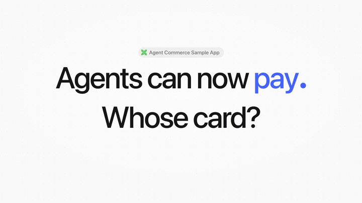
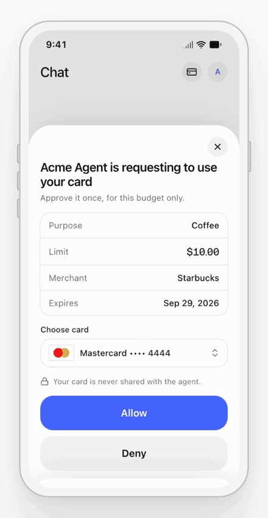
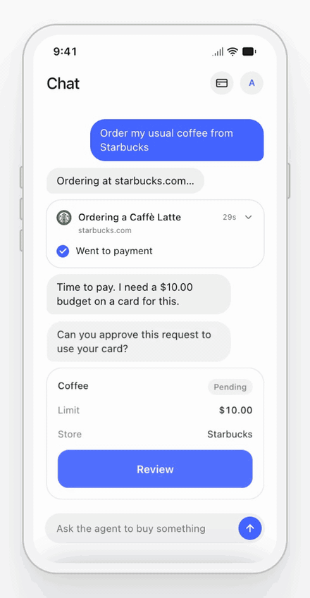
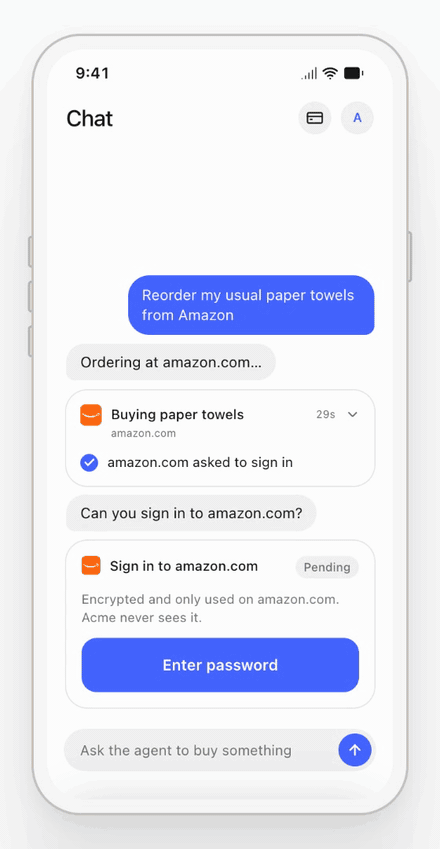

<div align="center">

# Agent Commerce Sample App

### Let AI agents buy with your users' own cards.<br>Your users approve every budget.

An open source sample app by [Crossmint](https://www.crossmint.com). Try it live, then build the same experience into your own agent app with [one prompt](#build-it-into-your-agent-app).

**[Try it live](https://agent-commerce.demos-crossmint.com/)** &nbsp;·&nbsp; [Read the docs](https://docs.crossmint.com/agents/overview) &nbsp;·&nbsp; [Talk to sales](https://www.crossmint.com/contact/sales)

<br>



</div>

<br>

## Three APIs. One approval screen that you host.

<table>
  <tr>
    <td width="33%" align="center"></td>
    <td width="33%" align="center"></td>
    <td width="33%" align="center"></td>
  </tr>
  <tr>
    <td valign="top">
      <b>Save cards. Approve budgets.</b><br>
      The card goes straight into Crossmint's PCI vault. It never touches your servers. The agent asks for an amount, a store and an expiry. The user approves once.
    </td>
    <td valign="top">
      <b>Buy on any website.</b><br>
      One call to Crossmint Agent Checkouts buys a product, books a table or a flight, or gets event tickets. It works with UCP and with any browser checkout.
    </td>
    <td valign="top">
      <b>Sign in to stores.</b><br>
      When a store asks for a login, the user types it once. It is encrypted, only that store uses it, and the agent never sees it.
    </td>
  </tr>
</table>

Visa Intelligent Commerce and Mastercard Agent Pay enforce each limit on the card network. Your users keep their points and rewards.

## Works where your agents are

The same APIs run every experience:

- **Your own app.** Add components to save cards, approve budgets and show receipts in your chat.
- **Messaging apps.** On iMessage, WhatsApp or Instagram, the agent sends a link. The user approves on a page that you host.
- **MCP hosts.** Add one URL to Claude, ChatGPT or Cursor. OAuth signs the user in the first time.
- **Terminal agents.** A CLI and a skill for Claude Code, Codex and other coding agents.

**[See every experience live at agent-commerce.demos-crossmint.com](https://agent-commerce.demos-crossmint.com/)**. Purchases in the live app are real.

## Build it into your agent app

Open your own app's repository in Claude Code, Cursor or Codex, and paste this prompt. Your coding agent reads the Crossmint docs and this sample app, then builds the same flows in your stack. The live app has a button that copies it too.

<!-- Keep this prompt the same as BUILD_PROMPT in apps/web/lib/build-prompt.ts. -->

<details>
<summary><b>Show the prompt</b></summary>

<br>

```text
Add agentic commerce to my app with the Crossmint Agents APIs. My users save a card
once. When my agent needs to pay, it asks for a budget, the user approves it inside my
app, and the agent buys on any website.

Use these sources:
- Crossmint docs index: https://docs.crossmint.com/llms.txt
- Agent cards: https://docs.crossmint.com/agents/cards-quickstart
- Agent Checkouts: https://docs.crossmint.com/agents/agent-checkouts-quickstart
- A working reference app: https://github.com/Crossmint/agent-commerce-sample-app
  (its HTTP API contract is in docs/API.md)

First, read my codebase. Tell me my framework, my auth provider, and where my agent
runs: an in-app chat, a messaging bot, an MCP server or a CLI. Then propose a plan
and wait for my OK before you write code.

Build these parts:
1. Save a card with the CrossmintPaymentMethodManagement component from
   @crossmint/client-sdk-react-ui. The card goes to Crossmint, never to my servers.
2. Agent cards. When the agent needs money, create an order intent with an amount,
   a merchant and an expiry. Show an approval screen in my app where the user picks
   a card and approves. Run OrderIntentVerification when the card rail needs it.
3. Agent Checkouts. Start a run at a product URL with a max cost and stream its
   messages. Answer each form request with all its fields in one answer. Pay its
   payment step with an agent card for the exact amount. Collect each protected
   field, such as a store password, with CrossmintProtectedInput.
4. Buyer details. Save the user's name, contact and shipping address as a buyer
   profile, so checkouts do not stop to ask for them.
5. Agent tools. Give my agent tools to list saved cards, request an agent card,
   start a checkout and answer it. Show each approval as a component in my UI, or
   as a link when the agent has no UI.
```

</details>

<details>
<summary>Run this sample app locally instead</summary>

<br>

You need a [Crossmint](https://www.crossmint.com/console) project (Agent Checkouts need a production server key) and a [Stytch](https://stytch.com) project for user login. A Postgres URL and an Anthropic or OpenAI key are optional.

```bash
git clone https://github.com/Crossmint/agent-commerce-sample-app.git
cd agent-commerce-sample-app
pnpm install
pnpm turbo run build --filter='./packages/*'
cp .env.example apps/web/.env.local
pnpm dev
```

Fill in your keys in `apps/web/.env.local`, then open http://localhost:3000. The comments in `.env.example` explain each variable.

</details>

## FAQ

<details>
<summary><b>How is this different from Stripe Link?</b></summary>

<br>

Link is a platform your users log into. This is a white-label experience embedded in your own app.

- It stays your app: your users, your design, no second login and no hand-off to somebody else's platform.
- These are agent cards, not the one-time-use cards Link issues. They run on Visa Intelligent Commerce and Mastercard Agent Pay.
- They are your users' own cards, scoped and enforced at the network level, so your users keep their points and rewards.
- Bank statements read as the merchant charging them directly, not as a Stripe charge.
- Refunds and chargebacks go straight to the merchant, with no Stripe in the middle.

</details>

<details>
<summary><b>Which card networks are supported?</b></summary>

<br>

Visa Intelligent Commerce and Mastercard Agent Pay for enforced limits, plus an encrypted-card fallback where the limit is advisory. Union Pay and AMEX are coming.

</details>

<details>
<summary><b>Is it production ready?</b></summary>

<br>

It is a sample app. It runs against production Crossmint keys and real cards, and it shows the flows end to end, but review it before shipping it to your users.

</details>

## What is inside

| Path | What it is |
|---|---|
| [`apps/web`](apps/web) | The Next.js site: the landing page, the app at `/app`, the HTTP API and the MCP endpoint. |
| [`packages`](packages) | The code behind the site: the Crossmint client, auth, API handlers, React components, the MCP server and the CLI. They are workspace packages, not published to npm. |
| [`skills/agent-commerce`](skills/agent-commerce) | A skill that teaches coding agents to use the CLI. |
| [`plugins`](plugins) | Claude Code and Cursor plugins with the hosted MCP server and the skill. |
| [`docs/API.md`](docs/API.md) | The HTTP API contract. |

## License

[MIT](LICENSE)
