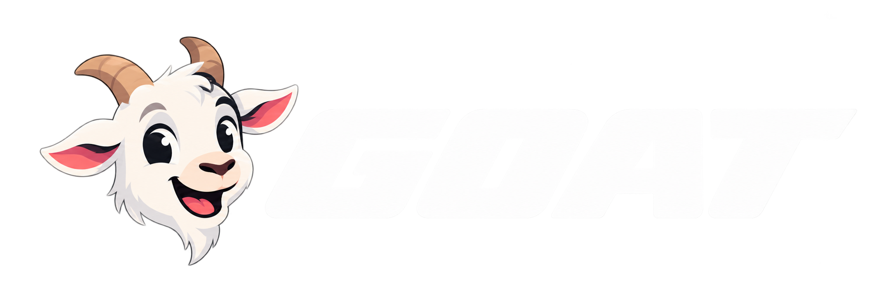

<p align="center">
  
</p>

<p align="center"><strong>An open source agentic commerce wallet, built on Crossmint.</strong></p>

GOAT shows how to add card payments for AI agents to your platform. A user saves a card. An agent asks for a bounded budget on it. The user approves in a browser. The agent then pays with a scoped card number, or lets Crossmint Agent Checkouts buy on its behalf.

GOAT is not a crypto wallet. It wraps the Crossmint Agents APIs and adds the parts Crossmint does not ship: the approval screen, the agent tooling, and the glue between them.

## What do I use?

| You have | You want | Install | Copy |
|---|---|---|---|
| A web app with users | Users save cards and grant your agent budgets | `@goat-wallet/core` `@goat-wallet/server` `@goat-wallet/ui` | the `(wallet)` routes from `apps/web` |
| An agent in Claude Code, ChatGPT, or a chat channel | A hosted place where users approve, plus agent tooling | Deploy `apps/web`. Give agents `goat` or the MCP URL | Nothing. Configure and deploy |
| Your own auth (Auth0, Clerk, Supabase) | All of the above with your login | Implement `UserAuth` from `@goat-wallet/auth` | `packages/auth/src/stytch.ts` as a template |
| Your own backend | Only the typed Crossmint client | `@goat-wallet/core` | Nothing |
| A chat product | Approve cards inline in the conversation | `@goat-wallet/ui` + `@goat-wallet/server` in process | the `(chat)` route group from `apps/web` |

## Packages

| Package | What it is |
|---|---|
| [`@goat-wallet/core`](packages/core) | Typed Crossmint Agents client. Rail selection. Encrypted-card decryption. Checkout action rendering. |
| [`@goat-wallet/auth`](packages/auth) | One `UserAuth` interface. Stytch adapter. Generic JWKS adapter. OAuth PKCE helpers. |
| [`@goat-wallet/server`](packages/server) | The GOAT HTTP API as Web-standard request handlers. Mounts in one Next.js route file. |
| [`@goat-wallet/ui`](packages/ui) | React components on shadcn/ui: save card, approve, verify, list, checkout. |
| [`@goat-wallet/mcp`](packages/mcp) | MCP server exposing the API as tools, with OAuth 2.1. |
| [`goat`](packages/cli) | The CLI. Same surface as MCP, for terminal agents and humans. |
| [`skills/goat`](skills/goat) | A skill that teaches coding agents how to use the CLI. |
| [`apps/web`](apps/web) | The reference website: wallet pages, agent chat, API, MCP endpoint. |

## How it flows

1. The agent runs `goat agent-card request --amount 50 --description "Flight to SF"` and gets an approval link.
2. The user opens the link, logs in, picks a card or adds one, and taps Allow. A passkey prompt appears once per device.
3. The agent polls until the card is active, then runs `goat agent-card reveal <id>` for a scoped card number, or `goat checkout create --url ... --agent-card <id>` to let Crossmint buy the item.

Read [docs/ARCHITECTURE.md](docs/ARCHITECTURE.md) for the full design and [docs/API.md](docs/API.md) for the HTTP contract.

## Run it locally

```bash
pnpm install
cp .env.example .env
pnpm dev
```

You need a Crossmint staging project, a Stytch project, and a Postgres URL. See `.env.example`. Agent Checkouts only work with a production Crossmint key.

Then, in another terminal:

```bash
pnpm --filter goat build
node packages/cli/dist/bin.js login --api http://localhost:3000/api/goat
node packages/cli/dist/bin.js agent-card request --amount 5 --description "Test" --wait
```

## License

MIT
