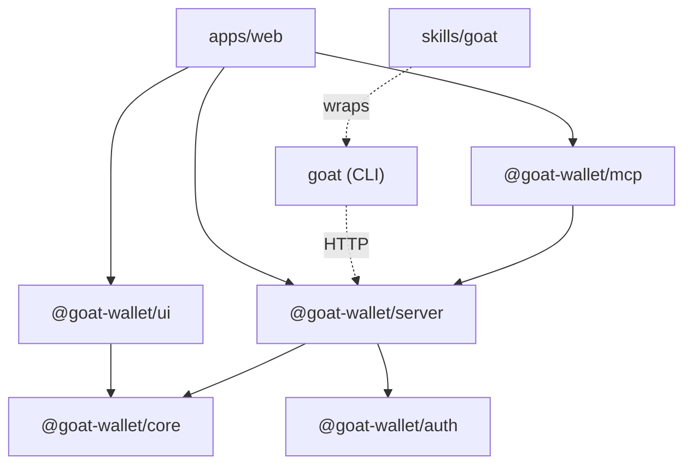
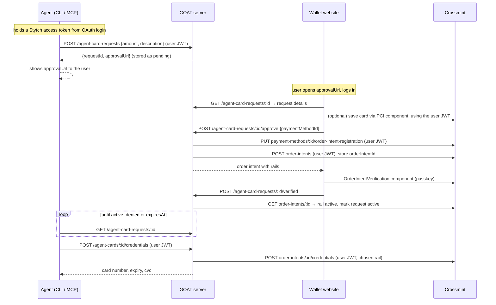
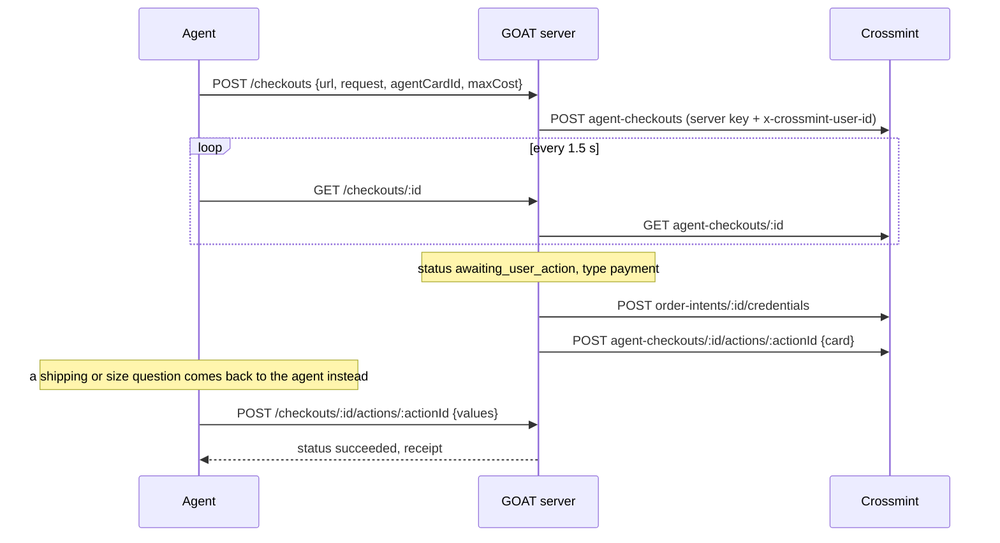

# GOAT architecture plan

GOAT is an open source monorepo. It shows how to add an **agentic commerce wallet** to your platform. A user saves cards. An agent asks for a bounded budget on one of those cards. The user approves. The agent then pays with a scoped card number, or lets Crossmint Agent Checkouts buy on its behalf.

GOAT is not a crypto wallet. It wraps the Crossmint Agents APIs and adds the pieces Crossmint does not ship: the approval UI, the agent-side tooling, and the glue between them.

This document is the plan. It describes the packages, what each one contains, how they connect, and how a developer picks what to copy.

---

## 1. Mental model

Four actors:

| Actor | Role |
|---|---|
| **User** | Owns the card. Approves budgets. Uses a browser. |
| **Platform** | Your product. Hosts the GOAT server and the wallet website. Owns auth. |
| **Agent** | Runs anywhere: Claude Code, ChatGPT, WhatsApp, your own chat UI. Has no browser. |
| **Crossmint** | Stores the card in a PCI vault. Mints scoped card numbers. Runs checkouts. |

Four primitives, all backed by Crossmint:

| GOAT name | Crossmint object | What it is |
|---|---|---|
| **Payment method** | `payment-methods/{id}` | A saved card. Created in the browser with the `CrossmintPaymentMethodManagement` component. |
| **Agent card** | `order-intents/{id}` | A bounded allowance on one payment method: amount, description, expiry, optional merchant. |
| **Credential** | `order-intents/{id}/credentials` | A scoped card number minted from an active agent card. |
| **Checkout** | `agent-checkouts/{id}` | A Crossmint-run purchase at any URL, paid with a credential. |

### Naming decision: "agent card"

The Crossmint API path says `order-intents`. The Crossmint API reference titles say "Agent Cards". Users and agents understand "agent card" without explanation. "Order intent" describes the API, not the user experience.

Recommendation:

- Use **agent card** in every user-facing string, CLI command, MCP tool, and README.
- Keep `orderIntent` only inside `@goat-wallet/core` types that mirror Crossmint responses.
- Never expose both names in the same surface.

Alternatives considered: "spend permit", "allowance", "budget", "mandate". All are correct. None are better than the name Crossmint and Ramp already use in market.

### The one hard constraint that shapes everything

Almost every Crossmint agents API needs **a client API key plus the user's JWT**. Save card, register card, create agent card, list, mint credentials, revoke: all of them.

Two steps can only happen in a browser:

1. Saving a card. The PCI component runs in the browser. Card data never touches your servers.
2. Verifying a Visa or Mastercard rail. The `OrderIntentVerification` component runs in the browser over HTTPS. It may create a passkey.

Everything else can run anywhere, as long as the caller has a valid JWT for the user.

The agent runs outside the browser. So the agent must **log in as the user**, the same way the browser does. The CLI and the MCP client obtain a normal user session through a browser login, keep it fresh, and send the user's JWT on every call. The GOAT server verifies that JWT and forwards it to Crossmint. There is no second identity system. Auth is the platform's normal user auth, everywhere.

---

## 2. Package map

```
goat/
├── packages/
│   ├── core/        @goat-wallet/core     Typed Crossmint client + domain logic. No framework.
│   ├── auth/        @goat-wallet/auth     UserAuth interface + adapters (Stytch, generic JWKS).
│   ├── server/      @goat-wallet/server   GOAT HTTP API as portable route handlers. Storage interface.
│   ├── ui/          @goat-wallet/ui       React components for save card, approve, verify, checkout.
│   ├── mcp/         @goat-wallet/mcp      MCP server exposing the GOAT API as tools. OAuth.
│   └── cli/         goat           CLI exposing the GOAT API as commands. Ships a skill.
├── apps/
│   └── web/                        Reference website. Wallet pages + agent chat + API + MCP endpoint.
├── skills/
│   └── goat/                       SKILL.md for Claude Code, OpenClaw and similar agents.
└── docs/
```

Dependency direction:



Rules:

- `@goat-wallet/core` depends on nothing from GOAT. It is the only package that talks to Crossmint.
- `@goat-wallet/ui` never calls Crossmint directly except through the two Crossmint React components. All other data goes through the GOAT API.
- The CLI and the MCP server never hold Crossmint keys. They hold the user's own session and talk to the GOAT API.
- The app is the example. Packages are the product.

---

## 3. Packages in detail

### 3.1 `@goat-wallet/core`

**Purpose.** One typed client for the Crossmint Agents APIs, plus the domain rules Crossmint leaves to you.

**Contents.**

- `CrossmintClient`: fetch-based. Constructor takes `{ clientApiKey, serverApiKey, environment }`. Every method takes a `{ jwt }` user context when Crossmint requires one. Method names mirror Crossmint one to one so they can be checked against the docs.
  - `paymentMethods.list / get / delete / registerForOrderIntents`
  - `orderIntents.create / list / get / revoke / mintCredential`
  - `checkouts.create / get / submitAction / createBuyerProfile`
  - `AgentCard` is exported as a type alias of `OrderIntent`. The rename to "agent card" happens in `@goat-wallet/server`.
- Types that mirror Crossmint responses: `OrderIntent`, `OrderIntentRail` (the `agentic-token` / `encrypted-card` / `spt` discriminated union), `Credential`, `Checkout`, `PendingUserAction`.
- `selectRail(orderIntent, preference)`: picks the rail to use. Fixed order: `agentic-token` (VIC or Agent Pay) if active, then `encrypted-card`. The Stripe `spt` rail is never used or shown.
- `EncryptedCardRail` helpers: generate an RSA-2048 JWK pair, pass the public key, decrypt the response with the private key.
- `EncryptedCardRail` fallback is best effort. Crossmint enforces the amount on network rails. It does **not** enforce it on `encrypted-card`. GOAT passes the amount through, marks the response `enforced: false`, and documents this.
- `renderPendingAction(responseSchema)`: walks the JSON Schema of a checkout `pendingUserAction` into a neutral field list. UI and CLI both render from it.
- `pollCheckout(id, { interval: 1500 })`: async iterator over status changes. Agent Checkouts have no webhooks.

**Runs on.** Server. Browser for types only.

**Does not contain.** Auth. Storage. HTTP routes. React.

### 3.2 `@goat-wallet/auth`

**Purpose.** Make "bring your own auth" a small, explicit job. Auth is the platform's normal user auth. Stytch is the default. Crossmint verifies the JWT against the provider's JWKS. GOAT adds nothing on top.

**Interfaces.**

```ts
interface UserAuth {
  // Verify a user JWT from a browser or an agent. Returns the user, or null.
  verify(jwt: string): Promise<{ userId: string; email?: string } | null>;
  // Optional. Exchange a long-lived session for a fresh short-lived JWT.
  // Stytch: sessions.authenticate(session_token). Auth0: refresh token grant.
  refresh?(session: string): Promise<{ jwt: string; expiresAt: Date }>;
}
```

That is the whole contract. The browser, the CLI, and the MCP client all send `Authorization: Bearer <user jwt>`. The server calls `verify`, then forwards the same JWT to Crossmint with the client API key.

**Adapters shipped.**

- `@goat-wallet/auth/stytch`: `verify` against the Stytch JWKS. `refresh` with the Stytch session token. Stytch sessions can last up to a year. JWTs last minutes. Refresh keeps the agent working without a new login.
- `@goat-wallet/auth/generic-jwks`: `verify` only, for any provider with a JWKS URL. Use this when your platform already has auth and only needs to hand GOAT a JWT.

**How the agent gets a user session.**

Both the CLI and MCP clients log in with **OAuth 2.1 against Stytch Connected Apps**. Connected Apps turns the Stytch project into an OAuth authorization server. GOAT writes no auth code and stores no auth state.

- **CLI.** `goat login` reads `GET /v1/config`, then runs the PKCE flow with a loopback redirect, the same as `gh auth login`. It opens the browser to the wallet's `/oauth/authorize` page, the Authorization URL registered in Stytch. The user logs in as normal, Stytch's `IdentityProvider` component shows the consent screen, and Stytch redirects to `http://127.0.0.1:<port>/callback` with the code. The token endpoint is `https://test.stytch.com/v1/public/<project id>/oauth2/token`, or your custom Stytch domain. The CLI exchanges it for an access token and a refresh token. For a remote shell with no local browser, `goat login --code` uses the redirect `<webBaseUrl>/cli-callback`, a public page that shows the code with a copy button, and the user pastes it back.
- **MCP.** The MCP host discovers the authorization server from the GOAT MCP endpoint metadata and runs the same OAuth flow itself. It manages refresh on its own.

Crossmint verifies JWTs against the Stytch session JWKS. In practice Stytch signs Connected Apps access tokens with the same project keys, so Crossmint accepts an agent's access token directly and the exchange below is a fallback that only runs when a token verifies against the IdP key set alone. On first sight of an access token it calls Stytch's access token exchange, gets a session token plus a session JWT, and stores them in `agent_sessions` keyed by a hash of the access token. Later requests reuse the stored JWT and refresh it through the session token. Stytch only allows the exchange for **first-party** clients with full access, within five minutes of issuance, once per token. The CLI app is **First-party, Public** with full access on. The MCP app is **Third-party, Public**: external hosts get a Stytch consent screen, and its tokens skip the exchange because Crossmint accepts them directly.

Every connected CLI or MCP host is a Stytch session on the user. The wallet's "Connected agents" list reads Stytch sessions and revokes them through Stytch.

**Settled.** Crossmint accepts any JWT it can verify against the configured JWKS, with the user id in `sub`. Stytch signs Connected Apps access tokens with the same project keys as session JWTs, so the MCP path should work with the access token as is. If a call rejects it, `@goat-wallet/auth/stytch` exchanges the access token for a session with the Stytch `sessions.exchange_access_token` endpoint and forwards the session JWT instead. The MCP server never sees this detail.

**Settled.** The docs only describe `x-crossmint-user-id` for Agent Checkouts. GOAT assumes it does not work for order intents. Every order-intent call carries the user's JWT. Agent Checkouts use the server key with `x-crossmint-user-id`, as documented.

### 3.3 `@goat-wallet/server`

**Purpose.** The GOAT HTTP API. This is what the CLI, MCP server, and UI talk to.

**Shape.** Web-standard `(req: Request) => Promise<Response>` handlers. They mount in one Next.js catch-all route and nothing else is needed. The same handlers run in any runtime that speaks `Request` and `Response`.

```ts
// apps/web/app/api/goat/[...path]/route.ts
import { createGoatHandlers } from "@goat-wallet/server";

const handlers = createGoatHandlers({
  crossmint: { clientApiKey, serverApiKey, environment },
  userAuth: stytchUserAuth,
  store: drizzleRequestStore(db), // or memoryRequestStore() for tests
  encryptedCardKeyPair,           // RSA JWK pair for the fallback rail
  baseUrl: "https://wallet.example.com",
});

export const { GET, POST, DELETE } = handlers;
```

**Routes.** One auth plane. Every route takes `Authorization: Bearer <user jwt>`. The browser sends the Stytch JWT from its session. The CLI and MCP client send the JWT they received at login. The server verifies it, then forwards it to Crossmint.

A request from an agent is a request from the user. An agent sees every agent card the user has, the same as the wallet page does. Scoping agent cards per agent would need state, so the reference does not do it. The requester's label goes into the order intent `description`, for example "Claude Code: flight to SF", so the user can tell them apart in the list.

**One table.** Stytch owns users and sessions. Crossmint owns cards, agent cards, credentials, and checkouts. GOAT stores only the thing neither of them has: the agent's pending request, from the moment the agent asks to the moment the user approves or denies. That is one table, `agent_card_requests`, behind a small `RequestStore` interface.

| Route | Caller | Purpose |
|---|---|---|
| `GET /v1/config` | none | Public: Stytch project, OAuth endpoints, client ids, web URL. Lets `goat login` work from the API URL alone. |
| `GET /v1/me` | user, agent | Who am I. |
| `GET /v1/payment-methods` | user, agent | List saved cards. Masked. Proxies Crossmint. |
| `POST /v1/payment-methods/:id/register` | user | Register a saved card for agent cards. Returns rails. |
| `DELETE /v1/payment-methods/:id` | user | Delete a saved card. |
| `POST /v1/agent-card-requests` | agent | Agent asks for a budget. Server stores it as `pending` and returns `{ requestId, approvalUrl }`. |
| `GET /v1/agent-card-requests/:id` | agent, user | Poll. `pending` → `approved` → `active`, or `denied` / `expired`. Carries `agentCardId` once created. |
| `POST /v1/agent-card-requests/:id/approve` | user | User picked a card. Server registers it if needed, creates the order intent with the user's JWT, stores the id. Returns the order intent for the verification component. |
| `POST /v1/agent-card-requests/:id/verified` | user | Page reports verification done. Server re-reads the order intent and marks the request `active`. |
| `POST /v1/agent-card-requests/:id/deny` | user | Marks `denied`. The agent's next poll sees it. |
| `GET /v1/agent-cards` | user, agent | List. Proxies Crossmint. |
| `GET /v1/agent-cards/:id` | user, agent | Balance, rails, status. |
| `POST /v1/agent-cards/:id/credentials` | agent | Mint a scoped card number. Server picks the rail. |
| `DELETE /v1/agent-cards/:id` | user, agent | Revoke. |
| `POST /v1/checkouts` | agent | Create an Agent Checkout. Server uses the **server** Crossmint key plus `x-crossmint-user-id`. |
| `GET /v1/checkouts/:id` | agent, user | Status. Includes `pendingUserAction` and `browser.embedUrl`. |
| `POST /v1/checkouts/:id/actions/:actionId` | agent | Answer a pending action. For payment actions the server mints a credential itself. The agent never sees the PAN. |

**Storage.** One interface, two implementations.

```ts
interface RequestStore {
  create(req: NewAgentCardRequest): Promise<AgentCardRequest>;
  get(id: string): Promise<AgentCardRequest | null>;
  update(id: string, patch: Partial<AgentCardRequest>): Promise<AgentCardRequest>;
}
```

`agent_card_requests`: id, user id (Stytch subject), requester label, amount, currency, description, merchant, expires at, status, crossmint order intent id, created at, updated at.

`agent_sessions`: access token hash, user id, Stytch session token, current session JWT, JWT expiry. Written when an agent's access token is exchanged. `checkouts`: checkout id, user id, agent card id.

`@goat-wallet/server/drizzle` ships the Postgres schema and the Drizzle implementation. `memoryRequestStore()` is for tests and for a first `pnpm dev` without a database. The web app points both the chat template and this table at the same Postgres.

Credential issuance is logged, not stored: rail, amount, merchant, agent card id. Never the PAN.

### 3.4 `@goat-wallet/ui`

**Purpose.** React components a platform drops into its own site, and the same components the web app uses.

**Components.**

- `<GoatProvider apiBaseUrl getJwt>`: wires the GOAT API and wraps `CrossmintProvider` with the user's session JWT from Stytch.
- `<SaveCard onSaved>`: wraps `CrossmintPaymentMethodManagement`. Then calls register. Reports which rails came back `enabled`.
- `<CardPicker>`: saved cards with rail badges. "Add a card" opens `SaveCard`.
- `<ApproveAgentCard requestId>`: the full approval screen. Shows who asks, how much, for what. `CardPicker` inside. On approve, calls the server, receives the order intent, mounts `<VerifyAgentCard>` if a rail is `pending_verification`. Ends in an "Active" state.
- `<VerifyAgentCard orderIntent>`: wraps `OrderIntentVerification`. Accepts the `appearance` prop.
- `<AgentCardList>`: list, balance, revoke.
- `<CheckoutView checkoutId>`: polls, renders `browser.embedUrl` in an iframe, renders any `pendingUserAction` from its JSON Schema via `<PendingActionForm>`.
- `<ConnectedAgents>`: the user's Stytch sessions, with labels and a revoke button.

Two layers: headless hooks (`useAgentCardRequest`, `useCheckout`, ...) and styled components on top. Styled with CSS variables so a platform can retheme without forking.

### 3.5 `@goat-wallet/mcp`

**Purpose.** Expose the GOAT API to MCP clients: ChatGPT, Claude, and any host that speaks MCP over streamable HTTP with OAuth.

**Tools.** Names mirror the CLI one to one.

- `list_payment_methods`
- `request_agent_card({ amount, currency, description, merchant?, expiresInHours })` → approval URL. The tool result tells the model to show the link to the user.
- `get_agent_card({ id })`
- `list_agent_cards`
- `reveal_agent_card({ id, amount?, merchant? })` → card number, expiry, CVC. Gated by scope `credentials:mint`.
- `create_checkout({ url, request?, agentCardId, maxCost })`
- `get_checkout({ id })`
- `answer_checkout_action({ id, actionId, values })`
- `revoke_agent_card({ id })`

Auth: OAuth 2.1 with Stytch Connected Apps as the authorization server. The MCP server is stateless. It forwards the bearer token to the GOAT API, which verifies it with `UserAuth.verify`.

Deployment: mounted at `/api/mcp` inside the web app, or run standalone with `npx @goat-wallet/mcp --api https://wallet.example.com`.

### 3.6 `goat` (CLI)

**Purpose.** The same surface as MCP, for terminal agents like Claude Code and for humans.

```
goat login [--api https://wallet.example.com]   # device-link flow; prints a URL
goat cards list                                 # saved payment methods
goat agent-card request --amount 50 --description "Flight to SF"  [--merchant united.com] [--wait]
goat agent-card status <requestId> [--wait]        # resume waiting after a timeout
goat agent-card list | get <id> | revoke <id>
goat agent-card reveal <id> [--amount 25]       # prints card number, expiry, cvc; --json
goat checkout create --url <product url> --agent-card <id> --max-cost 100 [--request "medium, black"] [--wait]
goat checkout get <id> | answer <id> <actionId> --values '{...}'
goat whoami | logout
```

Every command has `--json`. `--wait` polls until a terminal state. The `request` command prints the approval URL and, with `--wait`, blocks until the card is active.

The `goat` npm name already belongs to you. The last publish was `1.1.2` in 2024, so the first GOAT release should be `2.0.0`.

Config lives in `~/.config/goat/config.json`: API base URL, OAuth access token, refresh token. No Crossmint keys on the machine. `goat logout` revokes the Stytch session.

### 3.7 `skills/goat`

A `SKILL.md` that teaches a coding agent when and how to use the CLI. It covers: log in first, request before reveal, show the approval URL to the user, prefer `checkout create` over `reveal` when the target is a website, never paste a revealed card number into chat logs. Published alongside the CLI so `npx skills add crossmint/goat` or a plain copy works.

### 3.8 `apps/web`

Next.js App Router. The reference deployment and the "copy me" target. It is one website, the way a real platform is one website: an agent chat, plus the pages where a user manages cards and approvals.

Two route groups keep the halves separable:

```
apps/web/app/
├── (wallet)/
│   ├── page.tsx                 saved cards, agent cards, connected agents
│   ├── cards/new/page.tsx       save a card
│   ├── approve/[requestId]/     approve an agent card request (the link agents send)
│   └── checkouts/[id]/          watch a checkout, answer actions
├── login/, authenticate/        Stytch login and redirect callback
├── oauth/authorize/             Stytch IdentityProvider consent page, the Connected Apps Authorization URL
├── cli-callback/                shows the OAuth code for `goat login --code`
├── .well-known/oauth-protected-resource/  RFC 9728 metadata so MCP hosts find Stytch
├── (chat)/
│   └── chat/page.tsx            agent chat with inline approvals
├── api/goat/[...path]/route.ts  the GOAT API from @goat-wallet/server
├── api/mcp/route.ts             the MCP endpoint from @goat-wallet/mcp
└── api/chat/route.ts            streamText with tools. Only file that imports the model provider
```

**The wallet half** is what an external agent needs. CLI and MCP users only ever see `/approve` and the home page. Deploy this and you have a hosted place for users to approve budgets.

**The chat half** shows the in-process integration. It starts from the **Vercel AI Chatbot template**: AI SDK with `streamText` and `useChat`, Postgres through Drizzle for chat history, Vercel Blob for attachments, AI Elements for the UI. One change: **Auth.js is removed and Stytch takes its place.** The template's `users` table keys on the Stytch user id, its session helper reads the Stytch session, and its login page is the same Stytch login the wallet half uses. Everything else in the template stays.

Tools are defined once in `api/chat/route.ts` and call `@goat-wallet/core` directly in the same process, no HTTP round trip. Inline approval works through AI SDK tool parts. The model calls `request_agent_card`. The stream carries the tool call to the client. The message renderer sees a part of that tool type and renders `<ApproveAgentCard>` in its place. When the user approves, the client calls `addToolResult` with the new agent card id and the model continues. The tool has no server-side execute function for this step, which is the AI SDK pattern for human-in-the-loop tools.

The chat is optional. Delete the `(chat)` folder and `api/chat` and the app still builds. The nav hides the chat link when `ANTHROPIC_API_KEY` is not set.

One login covers both halves. The approval screen in the chat and the approval screen at `/approve` are the same component with the same session.

---

## 4. Flows

### 4.1 Agent outside the browser (CLI, MCP, WhatsApp)



### 4.2 Agent checkout instead of a raw card

Same start. After the agent card is active:



The server answers payment actions itself. The agent never holds a card number in this path. That is the preferred path and the skill says so.

### 4.3 Agent inside a web app (the chat half of apps/web)

No approval URL and no polling. The model's `request_agent_card` tool call streams to the client as a tool part. The chat renders `<ApproveAgentCard>` in that slot. The user approves in place. The client returns the agent card id as the tool result and the model continues.

### 4.4 Rail fallback inside `POST /agent-cards/:id/credentials`

1. Fetch the order intent. Read `rails[]`. Ignore the top-level status.
2. If an `agentic-token` rail is `active`: mint with `provider`, `amount`, and `merchant`. Card networks issue a number per merchant, so when the agent card is not locked to one the caller must name the store. Checkouts derive it from the target URL. Return the card. Crossmint enforces the limit.
3. Else use `encrypted-card`. Mint with the RSA public key, decrypt with the private key, return the card. Crossmint does not enforce the amount on this rail. GOAT does not either. The response carries `enforced: false` so the agent and the skill know the limit is advisory. Prefer `checkout create` on this rail, since the checkout's `maxCost` is enforced by Crossmint.
4. Log rail, amount, merchant, agent card id. Never the PAN.

---

## 5. What a developer copies

The README opens with one table:

| You have | You want | Use | Copy |
|---|---|---|---|
| A web app with users | Users save cards and grant your agent budgets | `@goat-wallet/core` `@goat-wallet/server` `@goat-wallet/ui` | the `(wallet)` routes from `apps/web` |
| An agent in Claude Code, ChatGPT, or a chat channel | A hosted place where users approve, plus agent tooling | Deploy `apps/web`. Give agents `goat` or the MCP URL | Nothing. Configure and deploy. Delete `(chat)` if unwanted |
| Your own auth (Auth0, Clerk, Supabase) | Everything above with your login | Implement `UserAuth.verify` and `refresh` from `@goat-wallet/auth`. Register your JWKS in the Crossmint console | `packages/auth/src/stytch` as a template |
| Your own backend and only need Crossmint calls | The thin typed client | `@goat-wallet/core` only | Nothing |
| A chat product | Approve cards inline in the conversation | `@goat-wallet/ui` + `@goat-wallet/server` in process | the `(chat)` route group and `api/chat` from `apps/web` |

Then a five-minute local quickstart: clone, `pnpm i`, copy `.env.example`, point `DATABASE_URL` at a Neon branch or `docker compose up` Postgres, `pnpm db:push`, `pnpm dev`, run `goat login --api http://localhost:3000`, run `goat agent-card request`, open the link, approve, run `goat agent-card reveal`. Staging Crossmint keys work for everything except Agent Checkouts, which are production only.

Each package README repeats the same structure: what it does, what it depends on, the three functions you will call, and a link to where the web app uses it.

---

## 6. Production deployment

The reference deployment is one Vercel project, one Postgres, and one Blob store.

| Piece | Where | Notes |
|---|---|---|
| `apps/web` | Vercel | Serves the wallet pages, the chat, `/api/goat`, `/api/mcp`. Custom domain with HTTPS. Verification requires HTTPS. |
| Postgres | Neon | One database. Drizzle migrations for the chat template tables and `agent_card_requests`. |
| Vercel Blob | Vercel | Chat attachments, from the template. |
| Stytch project | Stytch | Live environment. Redirect URLs on the wallet domain. Connected Apps enabled: a first-party public client for the CLI (PKCE, full access on, loopback redirect) and a third-party public client for MCP with the hosts' redirect URLs. Session duration set long enough for agents, for example 30 days. |
| Crossmint project | Crossmint console, production | One **client** key with scopes `payment-methods.*`, `order-intents.create/read/credentials/revoke`. One **server** key for `agent-checkouts`. Under JWT authentication choose Custom tokens with JWKS `https://test.stytch.com/v1/sessions/jwks/<stytch project id>`, issuer `stytch.com/<stytch project id>`, verifier `sub`. Or pick the Stytch preset with the project id. |
| RSA key pair | Env var or KMS | 2048-bit, for the `encrypted-card` fallback. Private key never leaves the server. |

Environment variables, all in `.env.example`:

```
CROSSMINT_ENV=production
CROSSMINT_CLIENT_API_KEY=ck_production_...
CROSSMINT_SERVER_API_KEY=sk_production_...
GOAT_BASE_URL=https://wallet.example.com
GOAT_ENCRYPTED_CARD_PRIVATE_KEY=...  # RSA JWK
DATABASE_URL=postgres://...
BLOB_READ_WRITE_TOKEN=...
STYTCH_PROJECT_ID=...
STYTCH_SECRET=...
NEXT_PUBLIC_STYTCH_PUBLIC_TOKEN=...
STYTCH_CLI_CLIENT_ID=...        # Connected Apps client for `goat`
STYTCH_MCP_CLIENT_ID=...
ANTHROPIC_API_KEY=...           # optional, enables the chat page
```

What the end user sees in production:

1. Their agent says: "I need $50 for the flight. Approve here: https://wallet.example.com/approve/req_…"
2. They open the link on any device. They log in with Google.
3. They pick a card or add one. They tap Approve. A passkey prompt appears once per device.
4. The page says "Active. Your agent can spend up to $50 until Friday."
5. Back in the chat, the agent continues. Later the wallet shows the agent card, what was spent, and a Revoke button.

For the platform, the CLI is `npm i -g goat`. The MCP URL is `https://wallet.example.com/mcp`. Both point at the same server.

---

## 7. Design

**Brand.** The GOAT mascot logo: a white cartoon goat head with tan horns and pink ears, next to the wordmark GOAT in a heavy italic sans. Source file is `docs/logo.png`. The web app uses copies at `apps/web/public/brand/logo.png` and a square crop of the head at `apps/web/public/brand/mark.png` for favicons and avatars.

**Reference.** Bento (bentonow.com) is the style reference. Take the feel, not the pixels:

- Dark warm ground, near-black with a hint of olive. Light text. One warm accent for primary actions.
- Mascot as a character. It appears in empty states, in the chat as the agent avatar, and small in the nav.
- Product surfaces drawn as small window frames with three dots, on top of textured backdrops.
- Big, plain headlines. Short subheads. Few words per screen.
- Rounded pill buttons. Soft borders. Nothing glassy.

**Components.** shadcn/ui on Tailwind, installed into `@goat-wallet/ui` so the web app and any adopter get the same primitives. AI Elements for chat, which is shadcn-based too. Theme tokens live in one CSS file in `@goat-wallet/ui` so a platform can retheme without forking.

**The approval screen.** Structure follows a fixed order and never adds to it:

1. Headline: "<Agent> is requesting to use your card".
2. Two labeled lines: Purpose, Limit. Merchant and Expires appear only when set.
3. "Choose card" with a select of saved cards, brand icon plus last four. "Add a new card" at the bottom of the list.
4. One reassurance line with a lock icon: "Your card number is never shared with the agent or the store."
5. One full-width primary button: Allow. A quiet text link under it: Deny.

Verification, when a rail needs it, replaces the button area in place. Success replaces the whole card with the mascot and "Active. <Agent> can spend up to <limit> until <date>."

---

## 8. Repo tooling

- pnpm workspaces plus Turborepo. `turbo dev`, `turbo build`, `turbo test`.
- TypeScript everywhere, strict mode, one shared `tsconfig` package. `tsup` for packages. Next.js App Router for apps. React 19.
- Changesets for versioning. Packages publish under `@goat-wallet/*`. The CLI publishes as `goat`.
- Vitest. `@goat-wallet/core` gets recorded Crossmint fixtures. `@goat-wallet/server` runs against the memory request store with Crossmint and Stytch mocked.
- Drizzle Kit for migrations. One schema package the web app and `@goat-wallet/server/drizzle` share.
- One `.env.example` at the root. Apps read from it in dev.
- `docs/` holds this file, a per-flow guide, and an ADR folder for the decisions in section 9.

---

## 9. Decisions

1. **Name**: settled. "Agent card" everywhere users can see. `orderIntent` only in core types.
2. **Auth**: settled. Normal user auth only. The agent logs in as the user through a browser link and keeps the Stytch session. Order-intent calls always carry the user JWT.
3. **One app**: settled. `apps/web` holds the wallet pages, the chat, the API, and the MCP endpoint. The chat is a deletable route group. `@goat-wallet/server` stays portable if anyone wants to split later.
4. **Server shape**: Web-standard request handlers mounted in Next.js route files. No extra framework.
5. **npm scope**: settled. `@goat-wallet/*` for packages. The CLI publishes as `goat`.
6. **Chat stack**: settled. Vercel AI Chatbot template with Auth.js replaced by Stytch. Postgres and Blob stay. Swapping the model is one line in `api/chat/route.ts`.
7. **Database**: settled. One Postgres. The chat template owns its tables. GOAT adds `agent_card_requests` and nothing else. Stytch holds users and sessions. Crossmint holds everything financial.
8. **Encrypted-card fallback**: settled. Always available, best effort, amount not enforced. Responses say so.

---

## 10. Build order

1. `@goat-wallet/core` against Crossmint staging. Save-card cannot be automated, so the `cards/new` page in `apps/web` comes with it.
2. `@goat-wallet/auth` with the Stytch adapter. Register Stytch in the Crossmint staging console. Connected Apps OAuth from the CLI.
3. `@goat-wallet/server` with the memory request store. Approval flow end to end in the web app. Then the Drizzle store.
4. `@goat-wallet/ui` extracted from the web app once the flow works.
5. `goat` CLI with `login`, `request`, `reveal`. Then the skill.
6. `@goat-wallet/mcp` with OAuth. Test from Claude and ChatGPT.
7. Checkouts, on a production Crossmint key.
8. The `(chat)` route group: pull in the AI Chatbot template, replace Auth.js with Stytch, add the GOAT tools.
9. Changesets, publish.
